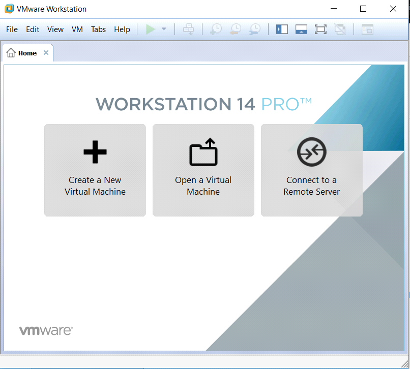
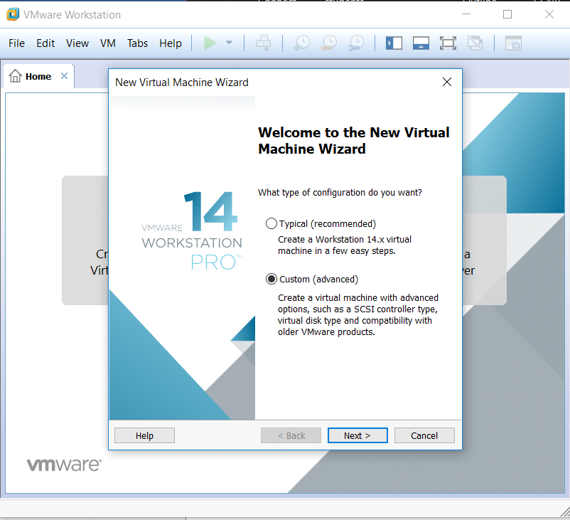
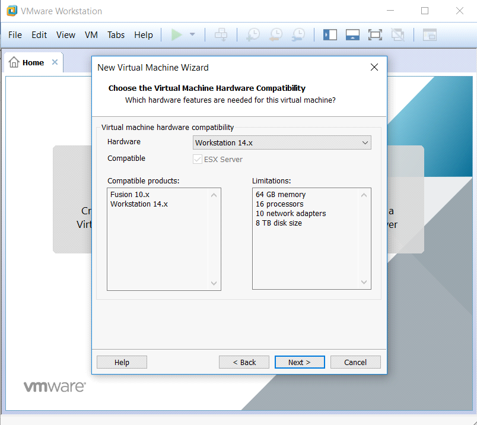
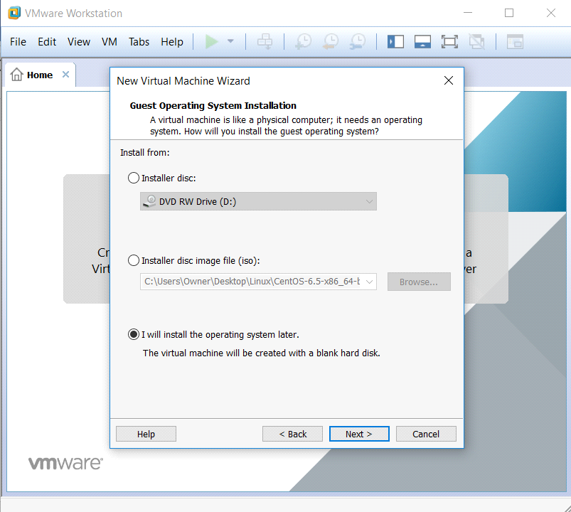

# Openfiler
SAN and NAS

# REQUIREMENTS
  - You need to have openfiler ISO file. [download it in here!](https://downloads.sourceforge.net/project/openfiler/openfiler-distribution-iso-2.99-x64/openfileresa-2.99.1-x86_64-disc1.iso)
  - VMware Workstation.

# INSTALLATION
  - Open your VMware Workstation.
  
  - Click File -> New Virtual Machine.
  
  - Click Next.
  
  - Click Next.
  
  - Click Next.
  
  - Select Linux (Version: Centos 6 64bit).
  - Click Next.
  - Enter Name of your server.
  - Select number of processors ( 2 CPU will do )
  - Click Next
  - Specify the amount of memory ( 2048 - 4096 will work )
  
 

# DESCRIPTION

Openfiler is an operating system that provides file-based network-attached storage and block-based storage area network. It was created by Xinit Systems, and is based on the CentOS Linux distribution. It is free software licensed under the GNU GPLv2
